# Changelog

## 2017 - Static beginnings

In June 2017 a friend showed me his website. It made me want a place of my own on the web, so I started by recreating the idea and then quickly moved toward something that felt more personal.

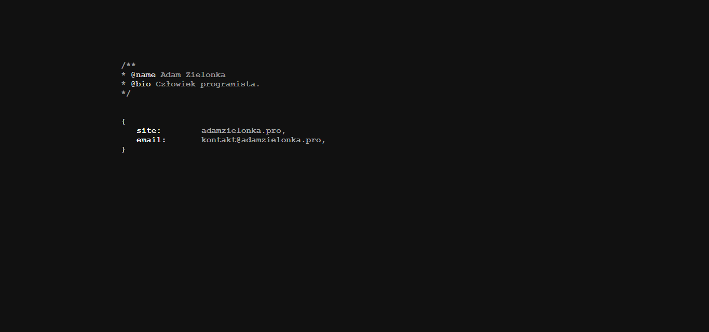

The next step was the first terminal-inspired version. It was still simple, but the direction of the project was already clear.

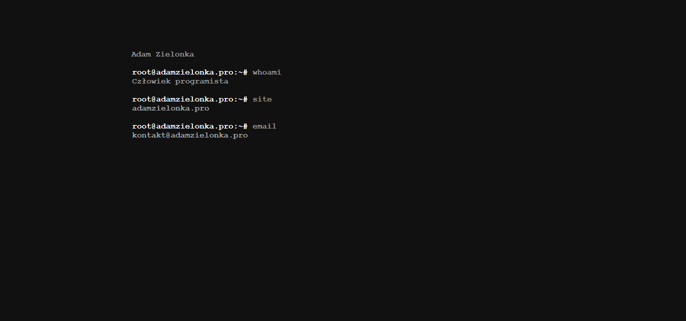
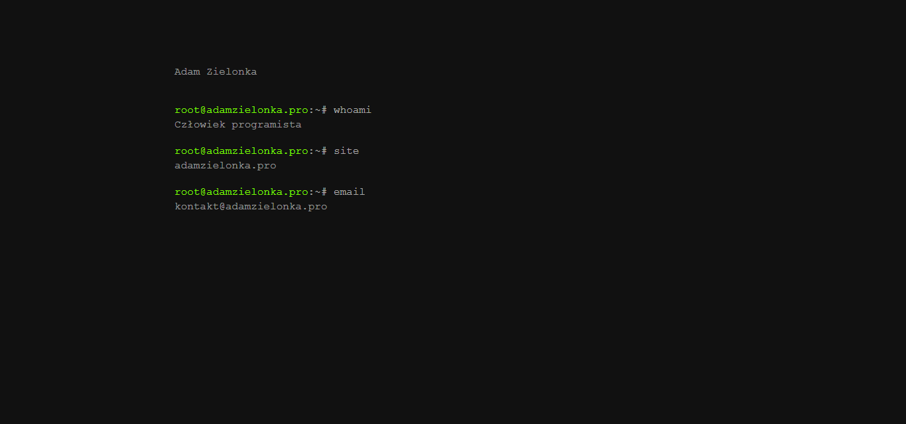
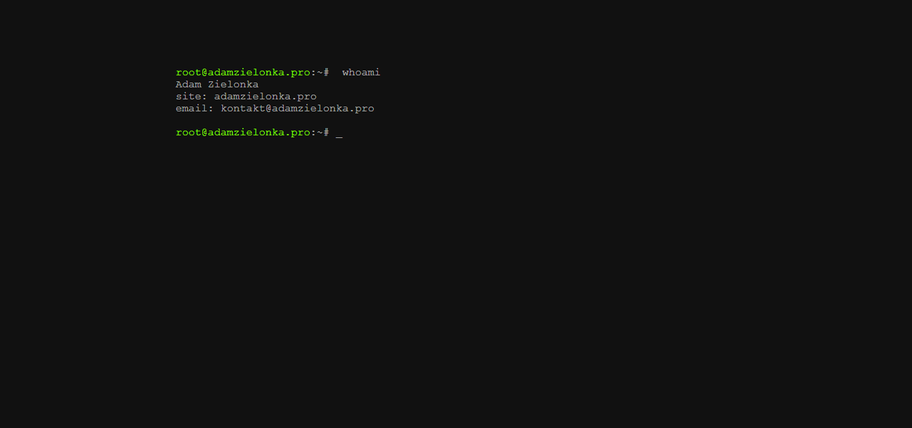
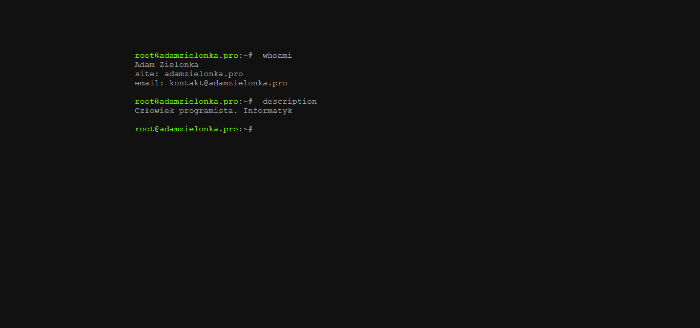
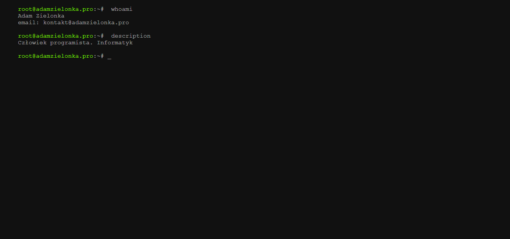

By October 2017 I finally had projects worth linking to, so the website started to feel like a portfolio instead of an empty shell.

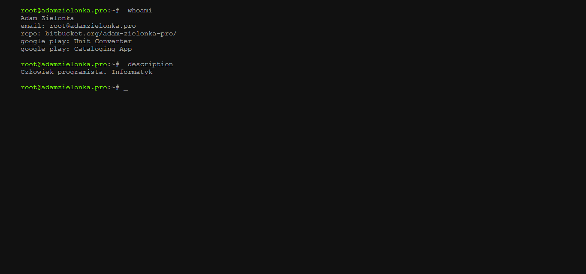

## 2018 - A clearer `whoami`

At the start of 2018 I reworked the `whoami` layout so the site could present more structured information: contact details, repositories, apps, and games.

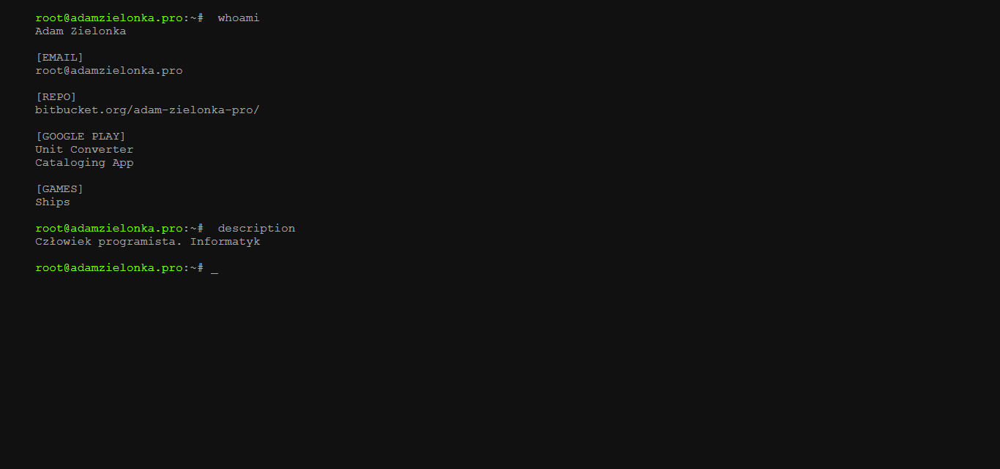
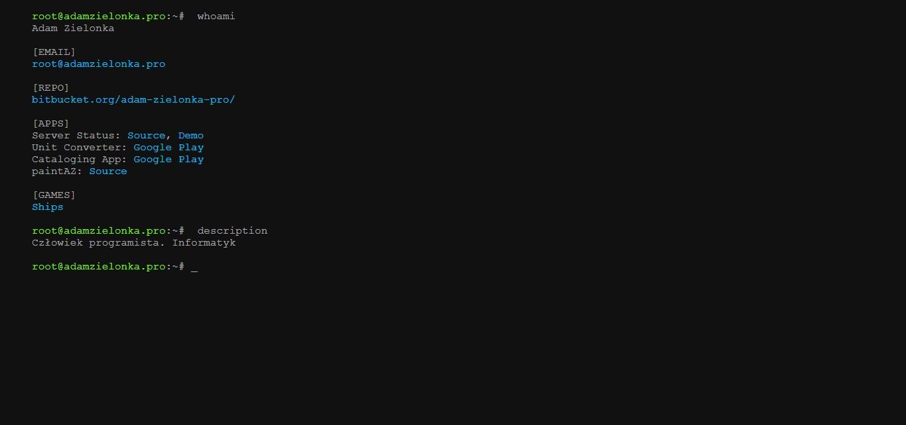
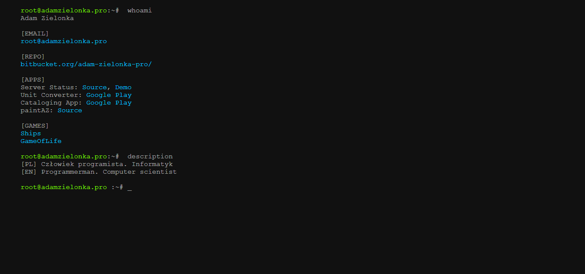

By autumn 2018 the static version had reached its final major polish pass.

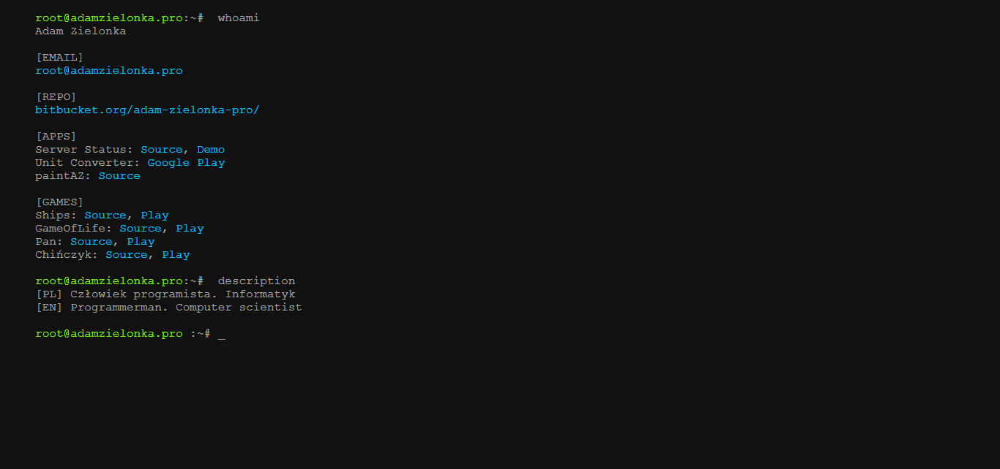

## 2019 - React and interaction

In March 2019 I moved the website to React. The static version stayed available as the `noscript` fallback, but the first React version still looked very close to the old site.

In August 2019 I rewrote the terminal code to support richer interaction and aligned the animation with the non-JavaScript version so both experiences felt consistent.

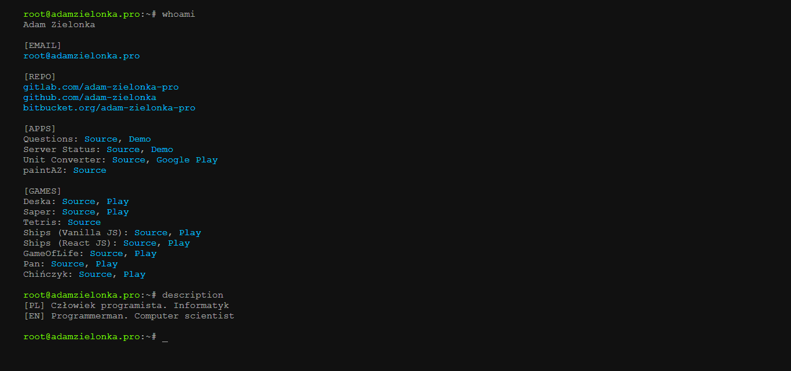

## 2021 - Svelte rewrite

In December 2021 a friend convinced me to try Svelte, and the site was rewritten again. Keeping markup, styles, and logic together felt great, and the rewrite took only a few days once the structure clicked.

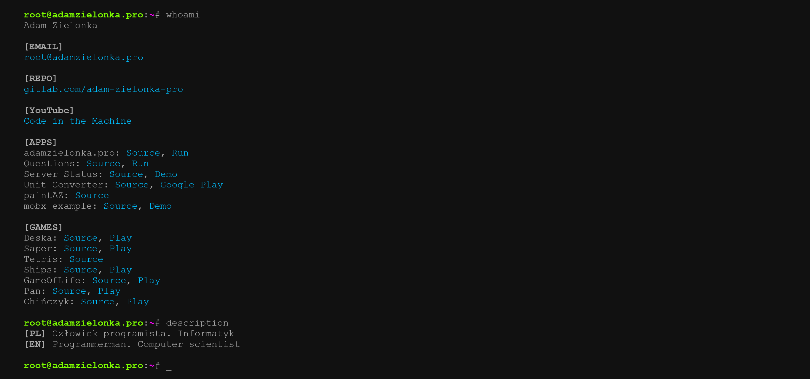

## 2023 - Back to React

On 5 February 2023 I moved the project back to React. I did not look at the old React code; I just rewrote the Svelte components again, this time with the benefit of everything I had learned in the meantime.

## 2024 - Goodbye React, goodbye MobX

On 5 May 2024 I rewrote the components with `createElement` and removed framework/runtime dependencies from the built version of the app.

## 2024 - Goodbye custom domain

At the end of May 2024 I decided to retire the custom domain. GitHub Pages is enough for this project and a better fit for a portfolio that doubles as a playground for experiments.

