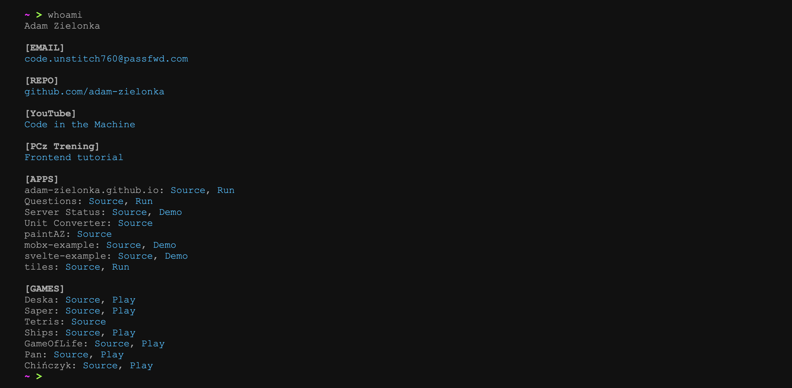

# adam-zielonka.github.io

Interactive terminal-style portfolio website, published at [adam-zielonka.github.io](https://adam-zielonka.github.io/).

## How to use

1. Go to website [adam-zielonka.github.io](https://adam-zielonka.github.io/)
2. Wait for start scripts ends.
3. Type something.
4. Press Enter key.
5. Enjoy ;-)
## Development

1. `pnpm install`
2. `pnpm dev`
3. `pnpm build`
4. `pnpm test`
5. `pnpm lint`

## Command files

Commands live in [`src/commands`](./src/commands/) as Markdown files with YAML front matter.

### Front matter

- `command` - command name
- `alias` - optional list of aliases
- `help` - description shown by the `help` command

### Body

The Markdown body is rendered line by line. Regular links stay clickable, and special action links control the terminal behavior:

- `sleep:` pause before rendering the next line, for example ``
- `system:` trigger built-in actions such as `clear`, `shutdown`, `freeze`, `help`, `font`, or `cd`
- `const:` inject runtime values such as `command`, `args`, and `pwd`
- `ui:` control rendering with `animate` or `hide`
- `css:` apply inline styles with CSS property names such as `color`, `font-weight`, `font-size`, or `margin-top`

## License

MIT
